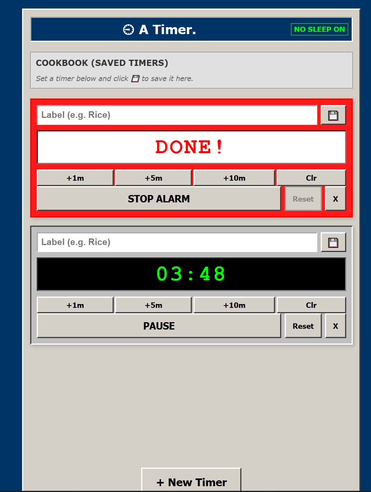

# ⏲️ Kitchen Command (Multi-Timer)

> A robust, retro-styled, distraction-free timing power tool designed specifically for home cooks.



## 📖 About
Most timer apps are too fiddle, too modern, or disappear when your phone locks. **Kitchen Command** is built to solve specific kitchen frustrations: messy hands, multitasking, and the need for reliability.

It features a high-contrast "Win95/Web 1.0" aesthetic for readability, robust state persistence (so you don't lose your timers if you refresh), and PWA capabilities to install it as a native app on your phone.

## ✨ Key Features

* **⚡ Rapid Entry:** Quick-add buttons (+1m, +5m) because typing "12:00" with dough on your hands is impossible.
* **🛡️ Crash Proof:** Uses `localStorage` to save state instantly. If you accidentally refresh or close the tab, your timers come back exactly where they left off.
* **👁️ No-Sleep Mode:** Implements the **Screen Wake Lock API** to keep your screen bright and visible while timers are running.
* **📱 Installable (PWA):** Works offline and installs to your home screen (iOS/Android) for a full-screen, native experience.
* **🔊 Generated Audio:** Uses the Web Audio API to generate synthesized alarms—no external MP3 files required.
* **📚 Cookbook Presets:** Save your frequently used times (e.g., "Soft Boiled Egg", "Steak", "Tea") to a quick-launch cookbook.
* **🎯 Drift-Free Logic:** Uses target-timestamp math instead of simple intervals, ensuring timers remain accurate even if the browser lags.
* **📑 Tab Awareness:** The browser tab title updates with the remaining time, so you can check progress while reading recipes in other tabs.

## 🚀 Quick Start

### Option 1: Live Demo
[Insert Link to GitHub Pages Here]

### Option 2: Run Locally
1.  Clone this repository.
2.  Open `index.html` in your browser.
3.  **Note:** To test PWA features (Service Worker) and Wake Lock, you must run the files over a local server (e.g., Live Server in VS Code) or HTTPS. They may not work via the `file://` protocol.

## 📂 Project Structure

```text
/
├── index.html       # The core logic, UI, and CSS
├── manifest.json    # PWA configuration (Name, Icons)
├── sw.js            # Service Worker for offline caching
└── icon-192.png     # (Optional) App Icon

📲 How to Install (Mobile)
On iOS (Safari):

Navigate to the hosted URL.

Tap the Share button (box with arrow).

Scroll down and tap "Add to Home Screen".

On Android (Chrome):

Navigate to the hosted URL.

Tap the Three Dots menu.

Tap "Install App" or "Add to Home screen".

🛠️ Technical Details
This project is built with Vanilla HTML, CSS, and JavaScript. No frameworks, no build steps, no bloat.

State Management: Reactive updates triggered by changes to a central timersState array, synced to localStorage.

Audio: AudioContext oscillator (Square wave) for that classic digital watch sound.

Animation: CSS Keyframes for the flashing visual alarm.

📄 License
This project is open source and available under the MIT License.